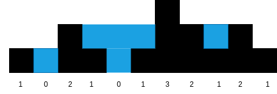

# Array Solved Problems:
* [Counting Pairs](CountPairs.cpp) : Given an array of N integers, and a number sum, the task is to find the number of pairs of integers in the array whose sum is equal to sum.

* [Counting Triplets](CountTriplets.cpp) : Given an array of N integers, and a number sum, the task is to find the number of triplets of integers in the array whose sum is equal to sum.
    #### Conditions:
    - All the numbers in the triples should be sorted.
    - All the triples should be sorted.
* [Mountain Problem](Mountain.cpp) : You may recall that an array arr is a mountain array if and only if:

    - arr.length >= 3
    - There exists some index i (0-indexed) with 0 < i < arr.length - 1 such that:
        - arr[0] < arr[1] < ... < arr[i - 1] < arr[i]
        - arr[i] > arr[i + 1] > ... > arr[arr.length - 1]

    Given an integer array arr, return the length of the longest subarray, which is a    mountain. Return 0 if there is no mountain subarray.
* [Longest Consecutive Sequence](LongConsSeq.cpp) : Given an unsorted array of integers nums, return the length of the longest consecutive elements sequence.You must write an algorithm that runs in O(n) time.
* [Rains](Rains.cpp) : Given n non-negative integers representing an elevation map where the width of each bar is 1, compute how much water it can trap after raining.

- 

## Assignments

[Minimum Difference](MinDiff.cpp): Implement a function that takes in two non-empty arrays of integers, finds the pair of numbers (one from each array) who absolute difference is closest to zero, and returns a pair containing these two numbers, with the first number from array. Only one such pair will exist for the test.

 

