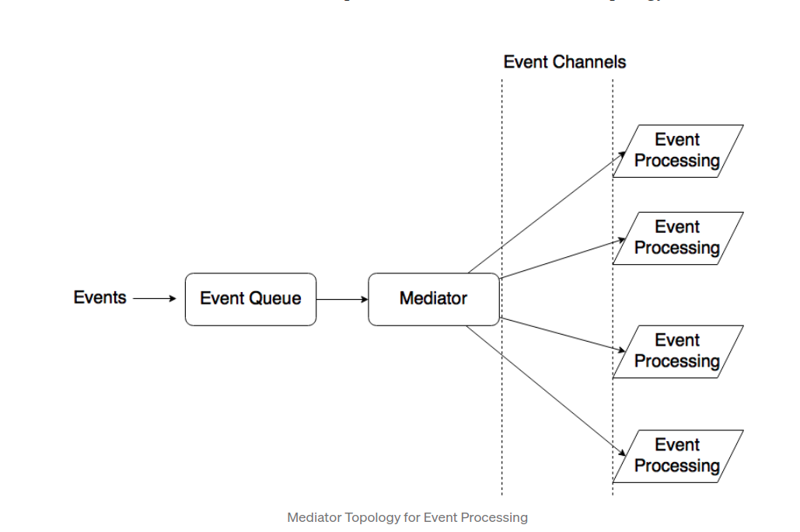
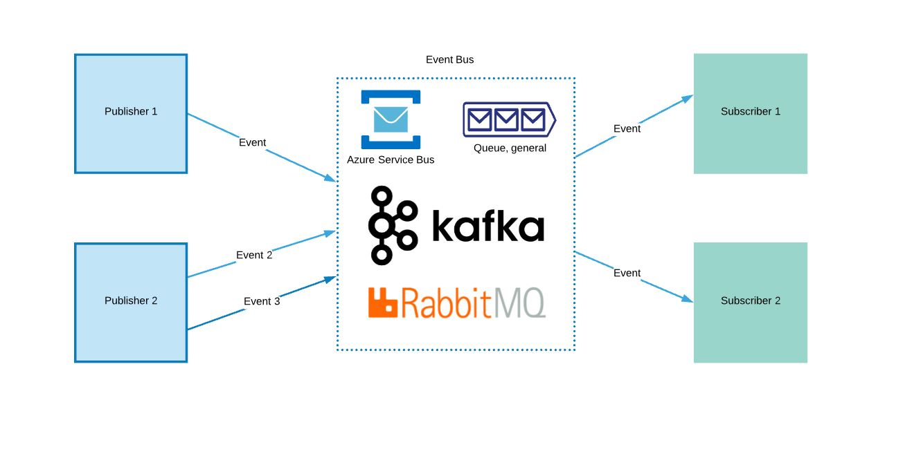

#### Component  

Small building block of Architecture

### Topics:

* What Is Domain-Driven Design (DDD)
* Building Domain Knowledge
* The Ubiquitous Language
* The Need for a Common Language
* Creating the Ubiquitous Language
* The Building Blocks Of A Model-Driven Design
* Layered Architecture
* Entities
* Value Objects
* Services
* Modules
* Aggregates
* Factories
* Repositories
* Refactoring Toward Deeper Insight
* Continuous Refactoring
* Bring Key Concepts Into Light
* Preserving Model Integrity
* Bounded Context
* Continuous Integration
* Context Map
* Shared Kernel
* Customer-Supplier
* Conformist
* Anticorruption Layer
* Separate Ways
* Open Host Service
* Distillation

## Types Of Architecture 

1.**Layer Architecture**

* Build out of layer ( i.e Tcp IP) 
  a. **Layer is closed (issue)** ( We can't send or access layer directly ). 
  b. Layer of isolation (Each layer is component and binded each other by interface).    
  c. No effect on any other layer if any underlying layer change. 
  d. Separation of concerns.  
  e. Architect decide which layer needs to open. 
  f. Open layer introduce cross layer concerns

### Layer Architecture Concerns

* Good General Architecture. 
* Sink Hole : Which out for architecture sinkhole anti-pattern (open layers).
* 80% close and 20% open layers.If you are doing only pass through then look for good architecture
* Tends to land at monolithic.

### Analysis 

  1. Overall Agility ( Low ) : Overall design : Small Design / Interface change leads to change everything
  2. Deployment ( Low )     : Small Change required redeployment.
  3. Testability ( Good )   : Easy to test each layer.
  4. Performance ( Low )    : Performance is low as multiple passes.
  5. Scalability ( Low )    : Layers are rigid
  6. Development ( Good )   : Easy to develop.
  7. Complexity  ( Good )   : Easy to develop.
  8. Loose Coupling ( Low ) : Tightly coupled with layer.

2.**Event Driven Architecture**

### Mediator Topology
All events are orchestrated by the Event Mediator. Events are published to mediator . This is a application or program which will decide 
* what subscriber gets the which event.
* Mediator sometime stores the states , data for complex application.

### Broker Topology
All the events are send to bus (a queue).
* It just stores the events as it is.
* events can be retrieves in FIFO manner.

# Low Level Design Simplified

1. [What is low level design](https://lnkd.in/dEuym7QW)
2. [APIs and Package Structuring](https://lnkd.in/dyb2sUFB)
3. [Single Responsibility Principle](https://lnkd.in/dBtGnApc)
4. [Prototype Design Pattern](https://lnkd.in/deEBx6nx)
5. [DRY principle](https://lnkd.in/drNd3-wu)
6. [Iterator Design Pattern](https://lnkd.in/dpVqMK6Q)
7. [Builder Design Pattern](https://lnkd.in/dysd5kvR)
8. [Open Closed Principle](https://lnkd.in/dDvFuQHa)
9. [Encapsulation](https://lnkd.in/dk7Kmy4R)
10. [Liskov Substitution](https://lnkd.in/dmnGnJtQ)
11. [Singleton and Null Patterns](https://lnkd.in/d-uCx3SV)
12. [Chain of Responsibility Pattern](https://lnkd.in/dMYh2wwd)
13. [Interface Segregation](https://lnkd.in/d9s-yJgZ)
14. [Dependency Inversion](https://lnkd.in/dMZQUakW)
15. [Proxy and Flyweight Patterns](https://lnkd.in/dZa5dT6r)
16. [State Pattern](https://lnkd.in/dNM2fvGG)
17. [Factory Pattern](https://lnkd.in/dxfAp7uz)
18. [Strategy Pattern](https://lnkd.in/dmppqC2q)
19. [Command Pattern](https://lnkd.in/dmArXYDt)
20. [Inheritance vs. Composition](https://lnkd.in/dZ5m2KTw)
21. [Publisher Subscriber Model](https://lnkd.in/dwr9SJak)
22. [Read your writes](https://lnkd.in/dgv8-P42)
23. [Async Processing](https://lnkd.in/d55-j-G8)
24. [Thread Pools and Ordering](https

  

